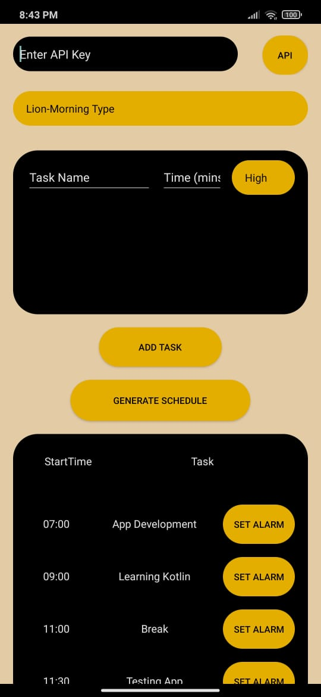
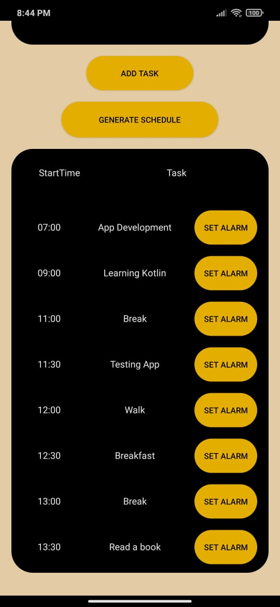

# 🌟 Personal Assistant App  

A smart daily scheduler tailored to your chronotype and task energy levels, powered by the Gemini API.  
Organize your day efficiently based on your energy highs and lows!
Open for collaboration.

---

## 🚀 Features  

- **Personalized Scheduling**: Generates a schedule based on your chronotype (Morning, Noon, Night).  
- **Task Categorization**: Categorize tasks by energy levels (High, Moderate, Low).  
- **Gemini API Integration**: Utilize your API key for intelligent scheduling.  
- **Dynamic User Input**:  
  - Chronotype selection.  
  - Input tasks, durations, and energy requirements (High, Moderate, Low).  

 

---


## 🛠️ How It Works  

1. **API Key Input**: Start by entering your Gemini API key.  
2. **Chronotype Selection**: Choose your chronotype (Morning, Noon, or Night).  
3. **Task Details**: Provide tasks with their durations and energy requirements (High, Moderate, Low).  
4. **Get Your Schedule**: View a customized schedule optimized for your chronotype and energy patterns.  

---

## 🖥️ UI Elements

### 1. API Key Input  


### 2. Chronotype Selection  


### 3. Task Input Form  

### 4. Generated Schedule 

### 5. Set Alarm  



---

## 💾 Installation  

1. Clone this repository:  
   ```bash  
   git clone https://github.com/FlowDevil/Personal-Assistant-App.git  
   cd Personal-Assistant-App  
